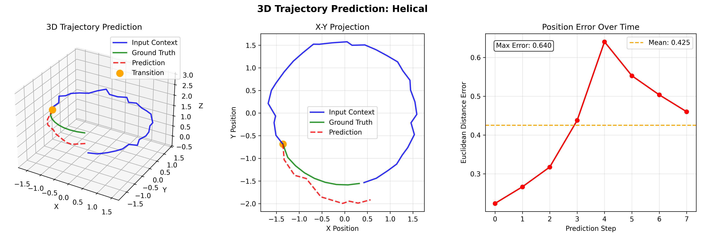

# m: Mixture-of-Experts Transformer Library with Examples

A production-ready, highly configurable Mixture-of-Experts (MoE) Transformer implementation designed for research and deployment. This system provides a modular, extensible architecture that cleanly separates routing logic, expert computation, and training infrastructure.

## 📊 Usage Examples & Visualizations

### Real-Time Training Visualization System

Our comprehensive visualization system provides both real-time matplotlib plots and rich terminal monitoring:


_Mixed dataset sequence-to-sequence prediction showing model behavior analysis with ground truth vs predictions across multiple examples_

---


_Geometric dataset sequence prediction analysis with various signal patterns and high correlation scores (0.99+)_

---

### MoE Training Dashboard


_Usable console output with progress bars and status tables_

---

Complete real-time training visualization with 4-panel layout:


_Early training phase: Loss curves with log scale, expert utilization tracking (8 experts), task-specific error metrics, and training throughput monitoring_

---


_Extended training phase: Continued loss convergence, stable expert utilization patterns, and consistent throughput performance over 500+ steps_

---

### 3D Trajectory Prediction Examples

Advanced 3D sequence prediction with spatial visualization:


_Mixed 3D trajectory: Full 3D visualization, X-Y projection view, and position error analysis over prediction steps_

---


_Lissajous curve prediction: Complex harmonic motion in 3D space with ground truth vs prediction comparison_

---


_Orbital mechanics prediction: Elliptical orbit pattern with precise trajectory following and error analysis_

---


_Helical trajectory prediction: DNA helix-like motion with spiral pattern prediction and accuracy metrics_

---

**Key Visualization Features:**

- 📈 **Real-time matplotlib plots** - Scientific visualization with publication-ready figures
- 🎨 **Rich terminal UI** - Beautiful progress bars and live metrics tables
- 🔍 **Expert utilization tracking** - Monitor how experts specialize during training
- ⚡ **Performance metrics** - Throughput, memory usage, and system diagnostics
- 🎯 **Dual visualization system** - Use both simultaneously for comprehensive monitoring

👉 See [docs/TRAINING_VISUALIZATION.md](docs/TRAINING_VISUALIZATION.md) and [docs/RICH_TRAINING.md](docs/RICH_TRAINING.md) for complete usage guides.

## 🏗️ System Overview

This implementation provides a complete MoE system with:

- **🧭 Flexible Routing**: TopK and Sinkhorn-Knopp routing algorithms with capacity management
- **🎯 Expert Networks**: Vectorized FFN experts with modern activations (SwiGLU, GEGLU, ReGLU)
- **⚡ Modern Architecture**: RoPE, RMSNorm, scaled initialization, and efficient attention
- **🚀 Production Features**: AMP training, gradient accumulation, checkpointing, and comprehensive logging
- **📊 Rich Monitoring**: Detailed metrics tracking and visualization tools


## 🔧 Getting Started

```bash

pip install uv -U
uv sync -U

# See all available commands
uv run --help | grep -E 'signals-|trajectory-|moe-'
```

### 🎯 Core CLI Commands

**MoE System Commands:**

```bash
# Demo the system with quick examples
uv run moe-demo --moe_cfg.router.n_experts 4 --moe_cfg.d_model 64

# Train models using domain examples (recommended)
uv run signals-train examples/geometric_signals/configs/small_moe.yaml

# Start inference server
uv run moe-serve path/to/model.pt --device auto --port 8080

# Build MoE components programmatically
uv run moe-build --moe_cfg.router.n_experts 8
```

**Example Applications:**

```bash
# Geometric signals (1D continuous values)
uv run signals-demo              # Generate demo data
uv run signals-train config.yaml # Train models
uv run signals-eval --latest     # Evaluate models
uv run signals-inference-demo    # Demo inference

# 3D trajectories (3D coordinate sequences)
uv run trajectory-3d-demo        # Generate 3D demos
uv run trajectory-3d-train config.yaml
uv run trajectory-3d-eval --latest
uv run trajectory-3d-inference-demo
```

## 🔧 Architecture Deep Dive

### Expert Configuration and Layout

The system organizes experts in a vectorized, per-expert parameter layout optimized for parallel computation:

```
Expert Parameters Layout:
┌────────────────────────────────────────────────────────────┐
│  W1: [E, D, H*2] (if gated) or [E, D, H] (if ungated)      │
│  b1: [E, H*2] or [E, H] (optional bias)                    │
│  W2: [E, H, D]                                             │
│  b2: [E, D] (optional bias)                                │
└────────────────────────────────────────────────────────────┘
where E=num_experts, D=d_model, H=d_hidden
```

**Expert Computation Modes:**

- **Grouped GEMM**: Uses `torch.bmm` for efficient batched matrix multiplication
- **Einsum Mode**: Uses `einops.einsum` for clarity and debugging
- **Activation Checkpointing**: Optional memory-compute tradeoff

### Routing Algorithm Details

#### TopK Router Flow

```
Input: x [B×S, D] → Logits [B×S, E] → Gates [B×S, E]
                           ↓
           Per-token Top-k Selection [B×S, k]
                           ↓
       Per-expert Capacity Assignment [C×E token indices]
                           ↓
         Build Dispatch/Combine Masks & Weights
```

#### Sinkhorn Router Flow

```
Input: x [B×S, D] → Logits [B×S, E] → Kernel K = exp(logits/τ)
                           ↓
         Optional Top-k Candidate Restriction
                           ↓
      Sinkhorn-Knopp Iterations (3-10 steps)
       Row constraints: Σ_e P[n,e] ≈ 1
       Col constraints: Σ_n P[n,e] ≈ N/E
                           ↓
         Final Assignment Matrix P [B×S, E]
```

### Data Flow Through MoE Block

Let's trace a complete forward pass with shapes and operations:

```ascii
INPUT PROCESSING:
┌─────────────────┐
│ x: [B, S, D]    │  →  Flatten  →  │ x_flat: [N, D] where N=B×S │
└─────────────────┘                 └────────────────────────────┘

ROUTING PHASE:
┌─────────────────┐      ┌──────────────────┐      ┌─────────────────┐
│ x_flat: [N, D]  │  →   │ Router Logic     │  →   │ RoutingInfo:    │
└─────────────────┘      │ - Logits [N, E]  │      │ - weights [N,E] │
                         │ - Temp scaling   │      │ - kept [N,E]    │
                         │ - Capacity calc  │      │ - capacity C    │
                         │ - Top-k select   │      │ - indices[C,E]  │
                         └──────────────────┘      └─────────────────┘

DISPATCH MODES:

┌─ INDICES MODE (Memory Efficient) ─┐    ┌─── DENSE MODE (Explicit) ───┐
│                                  │    │                              │
│  top_idx[C,E] → gather tokens    │    │  Build dispatch[E,C,N]       │
│  x_gather[E×C, D]                │    │  x_ecd = x_flat @ dispatch   │
│  x_ecd = x_gather.view(E,C,D)    │    │  x_ecd: [E, C, D]            │
│  Zero invalid with valid_ce      │    │  Zero invalid slots          │
└──────────────────────────────────┘    └──────────────────────────────┘

EXPERT COMPUTATION:
┌─────────────────┐      ┌──────────────────┐      ┌─────────────────┐
│ x_ecd: [E,C,D]  │  →   │ Vectorized FFN   │  →   │ y_ecd: [E,C,D]  │
└─────────────────┘      │ W1: bmm/einsum   │      └─────────────────┘
                         │ Activation       │
                         │ W2: bmm/einsum   │

COMBINE & OUTPUT:
┌─ INDICES MODE ─┐              ┌─── DENSE MODE ───┐
│                │              │                  │
│ Weighted sum   │              │ combine_ecn @    │
│ scatter_add    │     →        │ y_ecd → y_flat   │  →  [N,D] → [B,S,D]
│ back to tokens │              │                  │
└────────────────┘              └──────────────────┘
```

## 🧭 Core Components

### 1. Router Architecture

**BaseRouter** (`m/moe.py:137-210`) provides the common foundation:

- **Input Processing**: Optional RMSNorm/LayerNorm → Linear projection to expert logits
- **Noise Injection**: Gaussian or Gumbel noise for exploration during training
- **Temperature Scaling**: Configurable sharpening/softening of routing decisions
- **Auxiliary Losses**: Load balancing, z-loss, entropy regularization, margin enforcement

**RoutingInfo** (`m/moe.py:118-135`) containers all routing outputs:

```python
@dataclass
class RoutingInfo:
    combine_weights: torch.Tensor  # [N, E] post-drop renormalized weights
    kept_mask: torch.Tensor        # [N, E] bool mask for capacity survivors
    capacity: int                  # per-expert capacity C
    top_idx: torch.Tensor          # [C, E] token indices per expert
    valid_ce: torch.Tensor         # [C, E] valid capacity slots
    aux_lb: torch.Tensor           # load balance loss
    aux_z: torch.Tensor            # z-loss (logit magnitude)
    # ... additional metrics
```

**Available Router Implementations:**

#### TopKRouter (`m/moe.py:218-288`)

Classic MoE routing with order-agnostic capacity management:

```python
# Per-token top-k candidate selection
topk_val, topk_idx = torch.topk(gates, k=k, dim=-1)  # [N, k]

# Per-expert capacity assignment (order-agnostic)
capacity = int(capacity_factor * (N * k) / E)
scores = gates.masked_fill(candidate_mask <= 0, -inf)
top_val_ce, top_idx_ce = torch.topk(scores, k=capacity, dim=0)  # [C, E]
```

**Key Features:**

- Eliminates token-order bias through expert-wise selection
- Configurable router dropout for exploration (k=2 only)
- Post-drop weight renormalization

#### SinkhornRouter (`m/moe.py:290-358`)

Advanced routing with soft load balancing:

```python
# Build non-negative kernel
K = torch.exp(logits / sinkhorn_tau)  # [N, E]

# Sinkhorn-Knopp iterations
for _ in range(sinkhorn_n_iter):
    u = row_sums / (K @ v)      # Row normalization
    v = col_sums / (K.t() @ u)  # Column normalization

P = (u.unsqueeze(1) * K) * v.unsqueeze(0)  # Final assignment matrix
```

**Key Features:**

- Enforces both row (token) and column (expert) sum constraints
- Configurable candidate restriction (`sinkhorn_topk`)
- Better expert load balancing than TopK in many scenarios

### 2. Expert Networks

**ExpertFFN** (`m/moe.py:364-441`) implements vectorized per-expert computation:

```python
class ExpertFFN(nn.Module):
    def __init__(self, cfg: ExpertConfig, n_experts: int):
        # Vectorized parameters for all experts
        self.W1 = nn.Parameter(torch.empty(E, D, proj_in))  # First projection
        self.W2 = nn.Parameter(torch.empty(E, H, D))        # Second projection
        self.gated = cfg.activation in ("swiglu", "geglu", "reglu")
```

**Supported Activations:**

- **Ungated**: GELU, ReLU, SiLU
- **Gated**: SwiGLU, GEGLU, ReGLU (GLU variants for better parameter efficiency)

**Computation Modes:**

- **Grouped GEMM**: `torch.bmm(x_ecd, self.W1)` for maximum throughput
- **Einsum**: `einsum(x_ecd, self.W1, "e c d, e d h -> e c h")` for clarity
- **Activation Checkpointing**: Trade memory for recomputation during backward pass

**DenseFFN** (`m/moe.py:443-486`) serves as fallback for dropped tokens:

- Identical architecture to individual expert but operates on dropped tokens only
- Configurable fallback weight for blending with zero contribution

### 3. MoE Block Integration

**MoEFeedForward** (`m/moe.py:820-950`) orchestrates the complete MoE forward pass:

```python
def forward(self, x: torch.Tensor) -> tuple[torch.Tensor, dict]:
    routing = self.router(x)           # Get routing decisions
    x_flat = rearrange(x, "b s d -> (b s) d")

    # Dispatch tokens to experts (indices or dense mode)
    if self.cfg.router.dispatch_mode == "indices":
        x_ecd = self._dispatch_indices(x_flat, routing)
    else:
        x_ecd = self._dispatch_dense(x_flat, routing)

    y_ecd = self.experts(x_ecd)        # Expert computation
    y_flat = self._combine(y_ecd, routing)  # Combine expert outputs

    # Handle dropped tokens with fallback
    if self.fallback and routing.dropped_tokens.any():
        y_flat += self.fallback_weight * self.fallback(x_flat[dropped])

    return rearrange(y_flat, "(b s) d -> b s d", b=B, s=S), metrics
```

## ⚙️ Configuration System

The system uses a hierarchical dataclass-based configuration with jsonargparse for CLI integration. Each component has its own config class that composes into larger system configs.

### Configuration Schema

```python
@dataclass
class RouterConfig:
    # Core routing parameters
    router_type: Literal["topk", "sinkhorn"] = "sinkhorn"
    n_experts: int = 16              # Number of expert networks
    k: int = 2                       # Experts per token (top-k)
    capacity_factor: float = 1.25    # Expert capacity multiplier

    # Routing dynamics
    temperature: float = 1.0         # Softmax temperature
    noise_type: Literal["none", "gaussian", "gumbel"] = "gumbel"
    noise_std: float = 0.3          # Exploration noise strength
    router_dropout_prob: float = 0.05  # Route to 2nd-best only (k=2)

    # Auxiliary loss weights
    z_loss_weight: float = 1e-3     # Logit magnitude penalty
    load_balance_weight: float = 1e-2  # Expert load balancing
    entropy_weight: float = 0.0     # Routing entropy reward
    margin_weight: float = 0.0      # Top1-top2 margin enforcement

    # Infrastructure
    dispatch_mode: Literal["dense", "indices"] = "indices"
    use_router_ln: bool = True      # Pre-routing normalization
    use_rms_norm: bool = True       # RMSNorm vs LayerNorm
    renorm_after_drops: bool = True # Renormalize after capacity

    # Sinkhorn-specific (router_type="sinkhorn")
    sinkhorn_n_iter: int = 5        # Balancing iterations
    sinkhorn_tau: float = 0.7       # Assignment sharpness
    sinkhorn_topk: int = 8          # Candidate restriction

@dataclass
class ExpertConfig:
    expert_type: Literal["ffn"] = "ffn"
    d_model: int = 768              # Input/output dimension
    d_hidden: int = 3072            # FFN hidden dimension (4x is typical)
    activation: Literal["gelu", "relu", "silu", "swiglu", "geglu", "reglu"] = "swiglu"
    dropout: float = 0.1            # FFN dropout rate
    bias: bool = True               # Use bias in linear layers
    init: Literal["xavier_uniform", "xavier_normal", "scaled_xavier", "scaled_kaiming"] = "scaled_xavier"
    grouped_gemm: bool = True       # Use bmm vs einsum
    checkpoint_experts: bool = False # Gradient checkpointing
```

### Example Configurations

**Quick Start (Small Scale):**

```yaml
# examples/geometric_signals/configs/small_moe.yaml
model:
  block:
    moe:
      d_model: 128
      router:
        n_experts: 8
        k: 2
        router_type: "topk"
        load_balance_weight: 0.01
      expert:
        d_hidden: 512 # 4x expansion
        activation: "swiglu"
        dropout: 0.1
```

**Production Scale:**

```yaml
# moe.yaml (root config)
model:
  block:
    moe:
      d_model: 768
      router:
        n_experts: 16
        k: 2
        router_type: "sinkhorn"
        capacity_factor: 1.5
        sinkhorn_n_iter: 5
        sinkhorn_tau: 0.7
        load_balance_weight: 1e-2
      expert:
        d_hidden: 3072 # Standard 4x
        activation: "swiglu"
        grouped_gemm: true
        checkpoint_experts: false
```

## 🚀 Modern Architecture Features

### RoPE (Rotary Position Embedding)

Provides superior position understanding and extrapolation compared to absolute position embeddings:

```python
class RoPE(nn.Module):  # m/moe.py:539-619
    def forward(self, q: torch.Tensor, k: torch.Tensor) -> tuple[torch.Tensor, torch.Tensor]:
        # Apply rotary embeddings: q * cos + rotate_half(q) * sin
        cos, sin = self._get_cos_sin(seq_len, device, dtype)
        q_rot = q * cos + self._rotate_half(q) * sin
        k_rot = k * cos + self._rotate_half(k) * sin
        return q_rot, k_rot
```

### RMSNorm

More stable and efficient than LayerNorm, used in modern LLMs:

```python
class RMSNorm(nn.Module):  # m/moe.py:522-537
    def forward(self, x: torch.Tensor) -> torch.Tensor:
        rms = torch.rsqrt(x.pow(2).mean(dim=-1, keepdim=True) + self.eps)
        return x * rms * self.weight  # No bias, more stable
```

### Scaled Initialization

Residual-friendly initialization for deep networks:

```python
def scaled_init_(tensor: torch.Tensor, n_layers: int = 1, init_type: str = "scaled_xavier"):
    if init_type == "scaled_xavier":
        std = 0.02 / math.sqrt(2 * n_layers)  # Scale by depth
        nn.init.normal_(tensor, mean=0.0, std=std)
```

## 📊 Comprehensive Training System

The system includes a complete training infrastructure with modern features:

### Trainer Features (`m/moe.py:1356-1685`)

- **Mixed Precision Training**: FP16/BF16 autocast with gradient scaling
- **Gradient Accumulation**: Simulate larger batches on memory-constrained hardware
- **Advanced Scheduling**: Cosine decay with linear warmup
- **Smart Checkpointing**: Keep best K by metric + latest N checkpoints
- **Parameter Groups**: Separate learning rates for router, experts, and other components
- **Signal Handling**: Emergency checkpoints on SIGINT/SIGTERM
- **Comprehensive Logging**: JSONL logs with metrics, loss curves, and learning rates

### Training Configuration

```python
@dataclass
class OptimConfig:
    # Separate LRs for different component types
    lr_main: float = 1e-3           # General model parameters
    lr_router: float = 5e-4         # Router (often needs lower LR)
    lr_expert: float = 1e-3         # Expert networks

    # AdamW parameters
    weight_decay: float = 0.01
    betas: tuple[float, float] = (0.9, 0.95)
    max_grad_norm: float = 1.0      # Gradient clipping

    # Mixed precision & accumulation
    amp_dtype: Literal["fp16", "bf16"] = "bf16"
    grad_accum_steps: int = 1       # Effective batch = batch * accum_steps

@dataclass
class SchedConfig:
    total_steps: int = 10000
    warmup_steps: int = 1000        # Linear warmup phase
    min_lr_ratio: float = 0.1       # Cosine decay minimum
```

### Auxiliary Loss Management

The system carefully balances task loss with MoE auxiliary losses:

```python
# In model forward pass
task_loss = F.mse_loss(predictions, targets)
aux_loss = moe_metrics["aux_total"]  # Sum of all router losses
total_loss = task_loss + self.aux_weight * aux_loss  # Default aux_weight = 1e-2
```

**Key Auxiliary Losses:**

- **Load Balance Loss**: Encourages equal expert utilization
- **Z-Loss**: Prevents router logits from becoming too large
- **Entropy Loss**: Maintains routing diversity in early training
- **Margin Loss**: Enforces clear expert preferences (top1 > top2)

## 📈 Monitoring and Metrics

The system provides rich metrics for understanding MoE behavior:

### Router Metrics

```python
metrics = {
    "fraction_dropped_tokens": 0.023,    # Capacity overflow rate
    "expert_utilization": [0.12, 0.08, ...],  # Per-expert load [E]
    "gate_entropy": 2.31,                # Routing entropy (higher = more diverse)
    "capacity": 64,                      # Actual per-expert capacity
    "aux_load_balance": 0.002,           # Load balancing loss component
    "aux_z": 0.001,                     # Z-loss component
    "aux_entropy": 0.0,                 # Entropy loss component
}
```

### Training Metrics Dashboard

The system logs comprehensive metrics to JSONL for analysis:

```json
{"time": 1691234567, "step": 1000, "loss": 0.234, "lr": [0.001, 0.0005, 0.001]}
{"time": 1691234567, "step": 1000, "val_loss": 0.198, "best_val": 0.198}
```

## 🎯 Usage Examples

### Basic MoE Block Usage

```python
from m.moe import build_moe, MoEConfig, RouterConfig, ExpertConfig
import torch

# Create MoE configuration
cfg = MoEConfig(
    d_model=512,
    router=RouterConfig(n_experts=8, k=2, router_type="topk"),
    expert=ExpertConfig(d_model=512, d_hidden=2048, activation="swiglu")
)

# Build and use MoE block
moe = build_moe(cfg)
x = torch.randn(4, 128, 512)  # [batch, seq_len, d_model]
output, metrics = moe(x)      # Forward pass
print(f"Expert utilization: {metrics['expert_utilization']}")
```

### Training Loop Integration

```python
from m.moe import train, TrainConfig

# Configure full training run
cfg = TrainConfig(
    model=ModelConfig(
        n_layers=6,
        block=BlockConfig(moe=moe_cfg)
    ),
    optim=OptimConfig(lr_main=1e-3, amp_dtype="bf16"),
    sched=SchedConfig(total_steps=10000, warmup_steps=1000),
    out_dir="experiments/my_moe",
    run_name="baseline"
)

# Run training with checkpointing and logging
results = train(cfg)
```

### Configuration from YAML

```bash
# Train with domain-specific examples (easiest)
uv run signals-train examples/geometric_signals/configs/small_moe.yaml

# Or use general moe-train with inline parameters
uv run moe-train \
    --cfg.model.block.moe.router.n_experts 32 \
    --cfg.optim.lr_main 2e-3
```

## 🔬 Advanced Features

### Custom Router Implementation

```python
from m.moe import register_router, BaseRouter

@register_router("my_router")
class MyCustomRouter(BaseRouter):
    def forward(self, x: torch.Tensor) -> RoutingInfo:
        # Custom routing logic
        logits = self.route_logits(x)  # Use base class utilities
        # ... implement your routing algorithm
        return RoutingInfo(combine_weights=..., kept_mask=..., ...)
```

### Expert Specialization Analysis

```python
# Monitor which experts activate for different input patterns
def analyze_expert_usage(model, dataloader):
    expert_activations = []
    for batch in dataloader:
        with torch.no_grad():
            _, metrics = model(batch)
            expert_activations.append(metrics['expert_utilization'])

    # Analysis: which experts specialize in which patterns?
    return torch.stack(expert_activations)
```

### Memory-Efficient Training

```python
# Configuration for memory-constrained environments
cfg = MoEConfig(
    router=RouterConfig(
        dispatch_mode="indices",    # Memory-efficient dispatch
        capacity_factor=1.0,        # Tight capacity to reduce memory
    ),
    expert=ExpertConfig(
        checkpoint_experts=True,    # Trade compute for memory
        grouped_gemm=True,          # Efficient computation
        d_hidden=2048,             # Smaller experts if needed
    )
)
```

## 🎛️ Hyperparameter Tuning Guide

### Router Tuning

**Start with these values and adjust based on behavior:**

| Parameter             | Recommended Start | Adjust If                                                         |
| --------------------- | ----------------- | ----------------------------------------------------------------- |
| `n_experts`           | 8-16              | Too few: underutilization<br/>Too many: high overhead             |
| `k`                   | 2                 | k=1: faster, less smooth<br/>k>2: higher compute cost             |
| `capacity_factor`     | 1.25-1.5          | >2% drops: increase<br/>Low utilization: decrease                 |
| `load_balance_weight` | 1e-2              | Expert collapse: increase to 5e-2<br/>Too uniform: decrease       |
| `temperature`         | 1.0               | Early instability: increase to 1.5-2.0<br/>Need sharper: decrease |

### Expert Tuning

| Parameter      | Recommendation                          | Notes                                      |
| -------------- | --------------------------------------- | ------------------------------------------ |
| `d_hidden`     | 4x d_model for GELU<br/>2-3x for SwiGLU | Gated activations more parameter efficient |
| `activation`   | "swiglu"                                | Best quality/efficiency tradeoff           |
| `dropout`      | 0.0-0.1                                 | Higher for smaller datasets                |
| `grouped_gemm` | True                                    | Significant speedup on modern hardware     |

### Training Stability

**Common Issues & Solutions:**

- **Expert collapse** → Increase `load_balance_weight`, add entropy regularization
- **High drop rate** → Increase `capacity_factor`, reduce `k`
- **Router instability** → Lower router LR, increase `temperature`, add `z_loss_weight`
- **Memory issues** → Enable `checkpoint_experts`, use `dispatch_mode="indices"`, reduce `d_hidden`

### Scenario-Specific Recommendations

**Single-GPU Prototyping:**

- Router: `topk`, `n_experts=4-8`, `k=2`, `capacity_factor=1.5-2.0` (warmup) then 1.25
- Temperature: `1.5` down to `1.0`, `noise_type=gumbel` `noise_std=0.3` decaying to 0
- Experts: `activation=swiglu`, `d_hidden=2-3x d_model`, `grouped_gemm=True`
- Monitor: `fraction_dropped_tokens` (<1-2% after warmup) and `expert_utilization` (roughly uniform)

**Quality-Focused Training (Language Modeling):**

- `k=2`, `topk` or `sinkhorn` router
- `capacity_factor` 1.25-1.5, anneal from 2.0 in warmup phase
- `z_loss_weight=1e-3`, `load_balance_weight=1e-2` to `5e-2` (if collapse)
- Consider `sinkhorn_topk=8-16` to limit candidate set for speed

**Throughput-Bound Production Inference:**

- `k=1` (top-1 routing)
- `temperature=1.0`, `noise_type=none`, `router_dropout_prob=0`
- `fallback_policy=zero` for speed, or `dense` only if drop rates significant

**Long Sequences / High Batch Sizes:**

- Increase `capacity_factor` (1.5-2.0) to keep drop rates low
- `dispatch_mode=indices` for memory efficiency
- `checkpoint_experts=True` if memory is tight

**Memory-Constrained Environments:**

- `dispatch_mode=indices`, `amp_dtype=bf16`, `checkpoint_experts=True`, `grad_accum_steps>1`
- Reduce `d_hidden` or use SwiGLU at 2x `d_model` rather than GELU at 4x

### 🔍 Diagnostics and Monitoring

**Key Metrics to Monitor:**

- **`fraction_dropped_tokens`**: Aim for <1-2% after warmup (capacity overflow indicator)
- **`expert_utilization`**: Should be roughly uniform across experts (check for collapse)
- **`gate_entropy`**: Very low entropy early can signal premature collapse
- **`aux_total`**: Ensure gradients are flowing and magnitudes are reasonable relative to main loss

**Common Pitfalls:**

- **Order bias**: Avoided by expert-wise top-k across tokens (capacity assignment)
- **Determinism**: Disable noise, set seeds, avoid dataset shuffles for reproducible runs
- **Router saturation**: Use `z_loss_weight` to prevent extreme logit magnitudes

### 🚀 Distributed Expert-Parallel Scaling

The current implementation routes locally but is designed for easy distributed scaling:

- **Shard experts** across ranks using the same (expert, capacity) layout
- **Replace gather/scatter** with `all_to_all` operations
- **Compute local experts**, then `all_to_all` back and scatter-add to original token order
- The `RoutingInfo` maps and index layout are already compatible with this pattern

### 🔧 Extensibility

**Registries Enable Easy Extension:**

- **New Routers**: Inherit from `BaseRouter` and use `@register_router`
- **New Experts**: Inherit from base expert classes and use `@register_expert`
- **Metrics Callbacks**: MoE block can report per-step metrics to custom logging dashboards
- **Custom Models**: Replace the demo model/dataset with your own; Trainer scaffolding remains intact

## 🏃‍♂️ Quick Start

### Installation

```bash
# Clone the repository
git clone <repository-url>
cd m

# Install dependencies (requires uv)
uv sync

# Run a quick demo
uv run moe-demo

# Or with inline parameters
uv run moe-demo --moe_cfg.router.n_experts 4 --moe_cfg.d_model 64 --moe_cfg.expert.d_model 64
```

### Training Your First Model

```bash
# Use domain-specific examples (recommended for quick start)
uv run signals-train examples/geometric_signals/configs/small_moe.yaml

# Or use the general moe-train with inline parameters
uv run moe-train \
    --cfg.model.block.moe.d_model 128 \
    --cfg.model.block.moe.router.n_experts 8 \
    --cfg.model.block.moe.expert.d_hidden 512

# Monitor training progress
tail -f outputs/geometric_signals/*/train_log.jsonl
```

## 🚀 Production Inference Platform

The system includes a complete, production-ready inference server (`m/inference_server.py`) with advanced caching and optimization features.

### Key Features

**🔥 Advanced Caching System:**

- **KV Cache**: Efficient attention key-value caching for faster inference
- **Prefix Cache**: Reuse computation for common input prefixes
- **LRU Eviction**: Automatic cache management with configurable limits
- **Cross-Request Sharing**: Share cached prefixes across different requests

**⚡ Performance Optimizations:**

- **Mixed Precision**: FP16/BF16 support with automatic gradient scaling
- **Batched Inference**: Process multiple requests efficiently
- **Streaming Generation**: Support for autoregressive token generation
- **Device Auto-Detection**: Automatic GPU/CPU/MPS device selection

**🛡️ Production Ready:**

- **FastAPI Integration**: Full async web server with OpenAPI docs
- **Health Monitoring**: Built-in health check and statistics endpoints
- **Port Management**: Automatic port conflict resolution
- **Error Handling**: Comprehensive error handling and recovery
- **CORS Support**: Cross-origin resource sharing for web integration

### Architecture Overview


### Quick Start

**Start a server with a trained model:**

```bash
# Auto-detect device and start on port 8080
uv run moe-serve path/to/model.pt --device auto --port 8080

# Start with specific configuration
uv run moe-serve \
    outputs/geometric_signals/my_experiment/best_model.pt \
    --device cuda --port 8080
```

**Make inference requests:**

```bash
# Health check
curl http://localhost:8080/health

# Inference request
curl -X POST http://localhost:8080/infer \
  -H "Content-Type: application/json" \
  -d '{
    "request_id": "test_request",
    "tokens": [0.1, 0.5, -0.2, 0.8, 0.3],
    "max_new_tokens": 10,
    "temperature": 1.0,
    "use_cache": true,
    "reuse_prefix": true
  }'
```

### Advanced Configuration

**Inference Request Parameters:**

```python
{
    "request_id": "unique_id",           # Request identifier for caching
    "tokens": [0.1, 0.2, 0.3],          # Input sequence (continuous values supported)
    "max_new_tokens": 50,               # Maximum tokens to generate
    "temperature": 1.0,                 # Sampling temperature (0.1-2.0)
    "top_k": 50,                        # Top-k sampling (0 = disabled)
    "top_p": 0.9,                       # Nucleus sampling (0.0-1.0)
    "use_cache": true,                  # Enable KV caching
    "reuse_prefix": true                # Enable prefix cache reuse
}
```

**Server Configuration:**

```python
class InferenceEngine:
    def __init__(
        self,
        model: MoESequenceRegressor,
        device: str = "cuda",
        max_batch_size: int = 32,         # Maximum concurrent requests
        kv_cache_size: int = 1000,        # Maximum cache entries
        kv_cache_max_tokens: int = 1_000_000,  # Maximum cached tokens
    ):
```

### Performance Monitoring

**Real-time Statistics:**

```bash
# Get current statistics
curl http://localhost:8080/stats

# Response includes:
{
    "total_requests": 1250,
    "cache_hits": 892,
    "cache_hit_rate": 0.714,
    "total_prefix_tokens_reused": 45231,
    "kv_cache_entries": 156,
    "kv_cache_total_tokens": 234567
}
```

## 📋 Complete Examples

The `examples/` directory contains two comprehensive implementations showcasing different aspects of the MoE system:

### 🌊 Geometric Signals (`examples/geometric_signals/`)

**Signal processing and forecasting with MoE Transformers**

A complete implementation demonstrating continuous value prediction with geometric signals including sine waves, composite signals, and geometric projections.

**Key Capabilities:**

- **Signal Generation**: Diverse geometric patterns (sine, composite, geometric shapes)
- **Real-time Monitoring**: Live training visualization with loss curves and expert utilization
- **Architecture Comparison**: Multiple MoE configurations (small, large, dense baseline, Sinkhorn routing)
- **Production Integration**: Seamless integration with core inference platform
- **Comprehensive Evaluation**: Performance analysis with frequency domain analysis

**Quick Start:**

```bash
# Generate demo dataset
uv run signals-demo

# Train small model
uv run signals-train --config examples/geometric_signals/configs/small_moe.yaml --name my_experiment

# Evaluate trained model
uv run signals-eval --model outputs/geometric_signals/my_experiment/best_model.pt

# Start inference server
uv run signals-inference-demo --serve --port 8080
```

**Signal Types:**

- **Sine Waves**: Pure sinusoidal patterns with varying frequency, amplitude, and phase
- **Composite Signals**: Complex harmonic patterns from 1-4 sine/cosine components
- **Geometric Projections**: Circular motion, spirals, and Lissajous curves projected to 1D

**Research Applications**: MoE architecture research, time series learning, expert specialization analysis, transfer learning from synthetic to real signals.

👉 **[See Geometric Signals README](examples/geometric_signals/README.md)** for complete documentation.

### 🛸 3D Trajectories (`examples/trajectory_3d/`)

**3D trajectory prediction and modeling with MoE Transformers**

A comprehensive implementation for multi-dimensional prediction tasks, learning to predict future 3D positions from trajectory sequences including helical, orbital, chaotic, and robotic motion patterns.

**Key Capabilities:**

- **3D Trajectory Generation**: Diverse motion patterns (helical, orbital, Lissajous, Lorenz, robotic)
- **3D Visualization**: Interactive plots, animations, and real-time monitoring
- **Multi-Dimensional Analysis**: 3D-specific metrics including position, velocity, and acceleration errors
- **Expert Specialization**: Analysis of how experts specialize in 3D space and motion types
- **Production Integration**: Direct compatibility with inference platform for 3D data

**Quick Start:**

```bash
# Generate demo 3D trajectories
uv run trajectory-3d-demo

# Train small 3D model
uv run trajectory-3d-train examples/trajectory_3d/configs/small_3d_moe.yaml --name my_3d_experiment

# Evaluate with 3D metrics
uv run trajectory-3d-eval --latest

# Start 3D inference server
uv run trajectory-3d-inference-demo --serve --port 8080
```

**Trajectory Types:**

- **Helical Trajectories**: DNA helix patterns, spiral staircases with parametric control
- **Orbital Mechanics**: Elliptical orbits and planetary motion with realistic physics
- **Lissajous Curves**: 3D harmonic oscillations with complex frequency relationships
- **Lorenz Attractor**: Chaotic dynamics with butterfly effect and sensitivity analysis
- **Robotic Trajectories**: Smooth waypoint interpolation for pick-and-place operations

**Research Applications**: Multi-dimensional MoE research, 3D motion learning, spatial expert specialization, physics-informed learning, multi-modal trajectory prediction.

👉 **[See 3D Trajectory README](examples/trajectory_3d/README.md)** for complete documentation.

### 💡 Key Platform Insights

Both examples demonstrate critical discoveries about the MoE platform:

**🔄 Natural Multi-Modal Support:**

- Continuous values work seamlessly as "tokens" without modification
- Multi-dimensional data (3D coordinates) scales naturally
- No custom wrappers or adapters needed for different data types

**⚡ Zero-Overhead Integration:**

- Standard checkpoint format works directly with inference server
- All advanced features (KV caching, prefix caching) work automatically
- Production deployment requires no special handling

**🧠 Expert Specialization Across Domains:**

- Experts naturally specialize on signal types, spatial regions, and motion patterns
- Routing algorithms work identically across continuous and discrete data
- Load balancing maintains effectiveness across different domains

### 🎯 Example Usage Patterns

**Training and Evaluation:**

```bash
# Train on custom data
uv run <example>-train --config <config_path> --name <experiment_name>

# Comprehensive evaluation
uv run <example>-eval --model <model_path> --config <config_path>

# Compare multiple configurations
uv run <example>-compare
```

**Model Management:**

```bash
# List all trained models
uv run <example>-models list

# Interactive model selection
uv run <example>-models interactive

# Get latest model details
uv run <example>-models latest --details
```

**Production Deployment:**

```bash
# Demo inference integration
uv run <example>-inference-demo

# Start production server
uv run <example>-inference-demo --serve --port 8080 --device auto

# Create optimized deployment
uv run <example>-deploy --latest <deployment_name>
```

Each example includes:

- **Specialized Datasets**: Domain-specific data generation and loading
- **Model Configurations**: Optimized architectures for the task
- **Training Scripts**: Complete pipelines with real-time monitoring
- **Evaluation Tools**: Comprehensive performance analysis
- **Visualization Systems**: Real-time and post-training analysis
- **Production Integration**: Direct inference server compatibility
- **Testing Frameworks**: Comprehensive pytest validation

## 🧪 Testing and Validation

```bash
# Run comprehensive test suite
uv run pytest -v

# Test specific components
uv run pytest tests/test_routers.py -v
uv run pytest tests/test_experts.py -v
uv run pytest tests/test_moe_block.py -v

# Run training integration tests
uv run pytest tests/test_training.py -v
```

## 📚 Implementation References

This implementation draws from and extends several key papers and techniques:

### Core MoE Architecture

- **Switch Transformer** (Fedus et al., 2021): Expert capacity and load balancing
- **GLaM** (Du et al., 2021): Scaling and efficiency considerations
- **PaLM** (Chowdhery et al., 2022): Architecture patterns and training stability

### Routing Algorithms

- **TopK Routing**: Classic MoE with order-agnostic capacity assignment
- **Sinkhorn Routing** (Jang et al., 2021): Balanced assignment via optimal transport

### Modern Architecture Components

- **RoPE** (Su et al., 2021): Rotary position embeddings for better extrapolation
- **RMSNorm** (Zhang & Sennrich, 2019): More stable normalization
- **SwiGLU** (Shazeer, 2020): Gated activations for parameter efficiency

## 🤝 Contributing

We welcome contributions! Please see our guidelines:

### Code Style

- Follow the existing dataclass patterns for configuration
- Use type hints and docstrings
- Maintain clean separation of concerns between components
- Add comprehensive tests for new features

### Testing Requirements

- All new routers must pass the router test suite
- Expert implementations need expert-specific tests
- Integration tests for complete MoE blocks
- Performance benchmarks for significant changes

### Extensibility Points

The codebase is designed for easy extension:

- **New Routers**: Inherit from `BaseRouter` and use `@register_router`
- **New Experts**: Inherit from base expert classes and use `@register_expert`
- **Custom Datasets**: Follow the `Dataset` interface patterns in `examples/`
- **Training Loops**: Extend or replace the `Trainer` class as needed

---

## 🔍 Technical Deep Dive (Historical Notes)

<details>
<summary>Click to expand detailed technical flow documentation</summary>

### Complete Data Flow Analysis

Assume input x of shape [B, S, D], with N = B\*S tokens and E experts:

**1. Router input and logits:**

- Flatten tokens: x_flat [N, D].
- Optional LayerNorm, then linear projection to logits over experts: logits [N, E] (fp32).
- Optional noise (Gaussian or Gumbel), and temperature scaling.

**2. Gates and candidate experts:**

- Softmax over experts: gates [N, E], sums to 1 per token.
- For TopKRouter: take top-k per token to form a candidate mask. Optional router_dropout_prob can route only to the second-best with small probability during training (exploration).

**3. Capacity assignment:**

- Compute capacity per expert: C = floor(capacity_factor * (N*k)/E).
- Order-agnostic capacity: for each expert, pick top C tokens by the (masked) gate score. This creates top_idx [C, E] and valid_ce [C, E].
- Build kept_mask [N, E] marking which token->expert pairs are within capacity.

**4. Combine weights:**

- Multiply gates by kept_mask to zero-out dropped token->expert pairs.
- Renormalize per token after drops so weights sum to 1 across the surviving experts for that token.

**5. Dispatch to experts:**

- indices mode (recommended):
  - Gather x tokens for each (capacity slot, expert) using top_idx; reshape to x_ecd [E, C, D].
  - Zero invalid capacity slots with valid_ce^T.
- dense mode:
  - Build a [E, C, N] one-hot dispatch mask; einsum to produce x_ecd [E, C, D].

**6. Expert computation:**

- Run ExpertFFN over x_ecd to produce y_ecd [E, C, D].

**7. Combine back to tokens:**

- indices mode: compute per-slot weights from combine_weights and valid_ce; multiply y_ecd and scatter_add back to y_flat [N, D].
- dense mode: build combine_ecn [E, C, N]; einsum to y_flat [N, D].

**8. Fallback:**

- Identify tokens dropped by all experts: dropped [N].
- If fallback_policy is "dense", run DenseFFN on those tokens and add with fallback_weight.

**9. Output:**

- Reshape back to [B, S, D] and return output plus metrics (aux losses included).

</details>

---

_This implementation represents a complete, production-ready MoE system with extensive configurability, modern architectural features, and comprehensive training infrastructure. The modular design allows for easy experimentation while maintaining the performance characteristics needed for real-world deployment._
